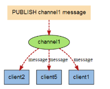
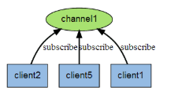

# redistest
* [1.项目简介](#1)
* [2.信号量简介](#2)
* [3.libevent简介](#3)
* [4.hiredisAPI简介](#4)
* [5.publisher - 发布者代码分析](#5)
	* [5.1 CRedisPublisher - 实现类](#6)

<h2 id="1">1.项目简介</h2>
订阅，取消订阅和发布实现了发布/订阅消息范式(引自wikipedia)，发送者（发布者）不是计划发送消息给特定的接收者（订阅者）。而是发布的消息分到不同的频道，不需要知道什么样的订阅者订阅。

订阅者对一个或多个频道感兴趣，只需接收感兴趣的消息，不需要知道什么样的发布者发布的。

这种发布者和订阅者的解耦合可以带来更大的扩展性和更加动态的网络拓扑。

<h3 id="2">2.信号量简介<h3>

使用C语言信号量需要包含: #include <semaphore.h>

结构体为: sem_t 

* 函数:
	* int sem_init(sem_t *sem, int pshared, unsigned int value);
		* 对sem_t 指定的信号量进行初始化。
		* pshared 为共享选择 为0时表示它是当前进程的局部信号量，否则其他进程能够共享这个信号(这个参数受版本的影响)，一般不支持进程间共享信号量，pshared传递一个非零将会使函数返回ENOSYS错误。
		* value 为整数型初始值
	
	*  int sem_post(sem_t * sem);
		* 给信号量的值加上一个1，它是一个原子操作即同时对同一个信号量做加“1”操作的两个线程是不会冲突的；而同时对同一个文件进行读、加和写操作的两个程序就有可能会引起冲突。信号量的值永远会正确地加一个“2”－－因为有两个线程试图改变它。
	* int sem_wait(sem_t *sem); 和 int sem_trywait(sem_t *sem);
		* 函数sem_trywait，它是sem_wait的非阻塞搭档。sem_trywait是一个立即返回函数，不会因为任何事情阻塞。根据其返回值得到不同的信息。如果返回值为0，说明信号量在该函数调用之前大于0，但是调用之后会被该函数自动减1，至于调用之后是否为零则不得而知了。如果返回值为EAGAIN说明信号量计数为0。
	* int sem_getvalue(sem_t *sem, int *valp);
		* 获得信号量sem的值，并保存到valp中。
	* int sem_destroy (sem_t *sem);
		* 这个函数也使用一个信号量指针做参数，归还自己占据的一切资源。在清理信号量的时候如果还有线程在等待它，用户就会收到一个错误。
		然而在linux的线程中，其实是没有任何资源关联到信号量对象需要释放的，因此在linux中，销毁信号量对象的作用仅仅是测试是否有线程因为该信号量在等待。如果函数返回0说明没有，正常注销信号量，如果返回EBUSY，说明还有线程正在等待该信号量的信号。

	* 使用步骤
		1. 声明信号量sem_t sem1;
		2. 初始化信号量sem_init(&sem1,0,1);
		3. sem_post和sem_wait函数配合使用来达到线程同步
		4. 释放信号量int sem_destroy (&sem1);

<h3 id="3">3.libevent简介</h3>
* Libevent是开源社区一款高性能的I/O框架库，其具有如下特点：
	1. 跨平台支持。Libevent支持Linux、UNIX和Windows。

	2. 统一事件源。libevent对i/o事件、信号和定时事件提供统一的处理。

	3. 线程安全。libevent使用libevent_pthreads库来提供线程安全支持。

	4. 基于reactor模式的实现。

* API:
	1. struct event_base *event_base_new(void);
		* 分配并且返回一个新的具有默认设置的 event_base。函数会检测环境变量,返回一个到 event_base 的指针。如果发生错误,则返回 NULL。选择各种方法时,函数会选择 OS 支持的最快方法。
	2. void event_base_free(struct event_base *base);
		* 有申请就有释放
	3. int event_base_dispatch(struct event_base *base);
		* event_base_dispatch ()等同于没有设置标志的 event_base_loop ( )。所以event_base_dispatch ()将一直运行,直到没有已经注册的事件了,或者调用 　　　　 event_base_loopbreak()或者 event_base_loopexit()为止。
　　   	如果想在移除所有已注册的事件之前停止活动的事件循环,可以调用两个稍有不同的函数 。
		int event_base_loopexit(struct event_base *base,const struct timeval *tv);
   		int event_base_loopbreak(struct event_base *base);

<h3 id="4">4.hiredisAPI简介</h3>
	Hiredis中的异步API函数需要与事件库（libevent,libev, ev）一起工作。因为事件循环的机制，异步环境中的命令是自动管道化的。因为命令是异步发送的，因此发送命令时，必要情况下，需要提供一个回调函数，以便在收到命令回复时调用该函数。

* API:
	1. redisAsyncContext *redisAsyncConnect(const char *ip, int port);
		* 异步连接redis服务器
	2. redisLibeventAttach
		* libevent 事件注册
	3. int redisAsyncSetConnectCallback(redisAsyncContext *ac, redisConnectCallback *fn);
		* 用于设置异步上下文中的建链回调函数。
	4. void redisAsyncDisconnect(redisAsyncContext *);
		* 断开异步连接
	5. void redisAsyncFree(redisAsyncContext *);
		* 释放内存
	6. int redisAsyncCommand(redisAsyncContext *ac, redisCallbackFn *fn, void *privdata, const char *format, ...);
		* redisAsyncCommand函数，是异步API中用于向Redis发送命令的函数。该函数与同步API中发送命令的函数redisCommand类似，同样支持printf式的可变参数。
		这里的fn和privdata分别表示收到命令回复后要调用的回调函数及其参数。因为Redis是单线程处理命令，因此当客户端使用异步API与事件库的结合之后，命令就自动的管道化了。也就是客户端在单线程模式下，发送命令的顺序和接收回复的顺序是一致的。因此，当发送命令时，就会将回调函数fn和参数privdata封装成回调结构redisCallback，并将该结构记录到单链表或者字典中。当收到回复后，就会依次得到链表或者字典中的redisCallback结构，调用其中的回调函数。

<h3 id="5">5.publisher - 发布者代码分析</h3>

<h3 id="6">5.1 CRedisPublisher - 实现类</h3>

* CRedisPublisher 
	1. init 
		* 初始化libevent, 信号量
	2. uninit 
		* 释放空间
	3. connect 
		* 异步连接到redis服务器
		* 将(libevent)事件绑定到redis服务上
		* 创建事件处理线程
		* 设置连接回调 
		* 设置断开连接回调
	4. disconnect
		* 断开连接
		* 释放回调
	5. publish
		* 发送消息
	6. connect_callback
		* 连接成功
	7. disconnect_callback
		* 断开连接
	8. command_callback
		* 执行命令回调
	9. event_thread
		* 事件处理线程
	10. event_proc
		* 事件处理

